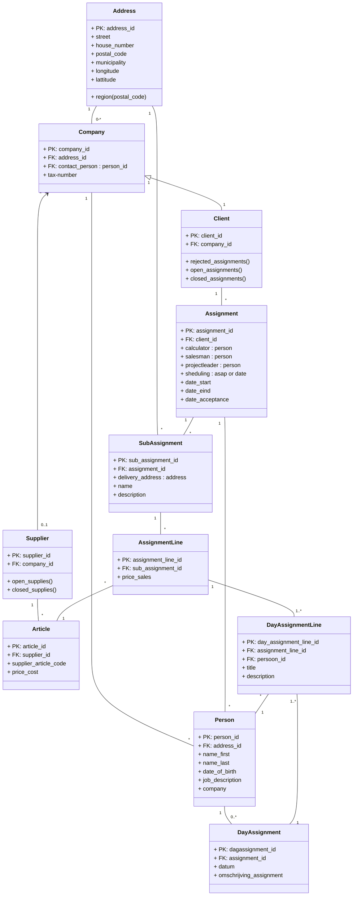

```mermaid
classDiagram

	class Address {
		+ PK: address_id
		+ street
		+ house_number
		+ postal_code
		+ municipality
		+ region(postal_code)
		+ longitude
		+ lattitude
		}
		Address "1"--"*" SubAssignment
		Address "1"--"0-*" Company

	class Company {
		+ PK: company_id
		+ FK: address_id
		+ FK: contact_person : person_id
		+ tax-number
		}
		Company "1"<|--"1" Client
		Company "1"<--"0..1" Supplier 
		Company "1"--"*" Person


	class Client {
		+ PK: client_id
		+ FK: company_id
		+ rejected_assignments()
		+ open_assignments()
		+ closed_assignments()
		}
		Client "1"--"*" Assignment


	class Person {
		+ PK: person_id
		+ FK: address_id
		+ name_first
		+ name_last
		+ date_of_birth
		+ job_description
		+ company
		}
		Person "1"--"0..*" DayAssignment


	class Supplier {
		+ PK: supplier_id
		+ FK: company_id
		+ open_supplies()
		+ closed_supplies()
		}
		Supplier "1"--"*" Article


	
	class Assignment {
		+ PK: assignment_id
		+ FK: client_id
		+ calculator : person
		+ salesman : person
		+ projectleader : person
		+ sheduling : asap or date
		+ date_start
		+ date_eind
		+ date_acceptance
		}
		Assignment "1"--"*" SubAssignment
		Assignment "1"--"*" Person


	class SubAssignment {
		+ PK: sub_assignment_id
		+ FK: assignment_id
		+ delivery_address : address
		+ name
		+ description
		}
		SubAssignment "1"--"*" AssignmentLine


	class AssignmentLine {
		+ PK: assignment_line_id
		+ FK: sub_assignment_id
		+ price_sales
		}
		AssignmentLine "*"--"1" Article
		AssignmentLine "1"--"1..*" DayAssignmentLine


	class Article {
		+ PK: article_id
		+ FK: supplier_id
		+ supplier_article_code
		+ price_cost
		}


	class DayAssignment {
		+ PK: dagassignment_id
		+ FK: assignment_id
		+ datum
		+ omschrijving_assignment
		}
		DayAssignmentLine "*"--"1" Person
		DayAssignment "1"--"1..*" DayAssignmentLine
	


	class DayAssignmentLine {
		+ PK: day_assignment_line_id
		+ FK: assignment_line_id
		+ FK: persoon_id
		+ title
		+ description
	}


	

```
