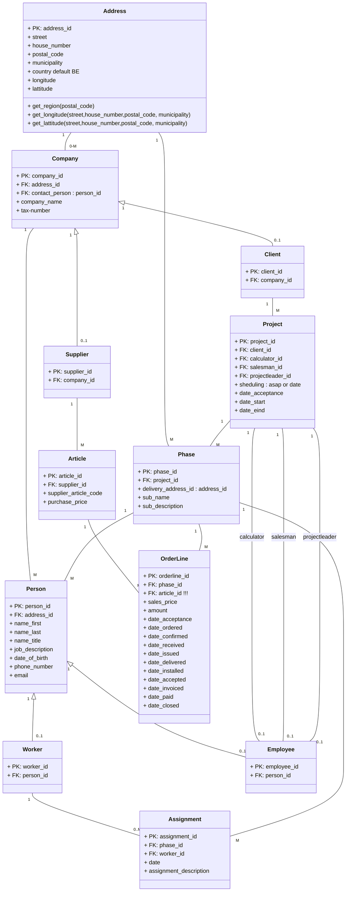
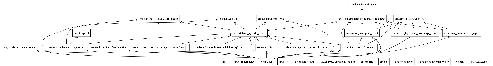
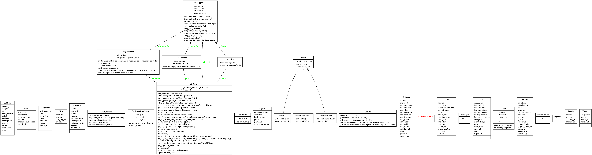

# Project samenvatting

## Overview
Kitch is een bedrijf dat keukentoestellen plaatst en keukeninrichting doet. 
+ Volgende zaken worden niet door het bedrijf gedaan:
	+ Het bedrijf doet zelf geen productie van toestellen of meubilair, maar koopt deze aan via leveranciers binnen of buiten de internationale groep waartoe dit bedrijf behoort
	+ Binnenafwerking aan het gebouw worden uitbesteedt aan onderaannemers ("betegeling, valse plafonds,...")
+ Volgende werken worden welk door het bedrijf uitgevoerd:
	+ offertes maken voor inrichting van grootkeukens
	+ leveren van keukenmeubilair en toestellen
	+ uitbreken van keukentoestellen en inox-meubilair
	+ aansluiten van keukentoestellen en inox-meubilair


## Architectuur, gebaseerd op drie kerncomponenten:

### GUI
- **Shiny**: Lichtgewicht en modern Python-framework voor het bouwen van web-, desktop- en mobiele apps.
- **Folium**: Gebruikt voor interactieve geografische visualisaties (kaarten) op basis van Leaflet.js.
- Samen zorgen ze voor een intuïtieve, responsieve en visueel aantrekkelijke gebruikersinterface.

### Datalaag
- **SQLAlchemy**: Object-Relational Mapper (ORM) voor efficiënte en veilige interactie met de databank.
- Zorgt voor abstractie van SQL en maakt het werken met datamodellen eenvoudig en krachtig.

### Database
- **PostgreSQL**: Krachtig en betrouwbaar relationeel databasesysteem.
- Ideaal voor complexe datamodellen en schaalbare toepassingen.
- (Optioneel: uitbreidbaar met PostGIS voor georuimtelijke gegevens.)

---

## Technisch Overzicht

### Componentenoverzicht

| Component       | Technologie | Functie                                     |
|----------------|-------------|---------------------------------------------|
| GUI            | SHINY       | Gebruikersinterface                         |
| Kaartvisualisatie | Folium      | Interactieve kaarten (Leaflet.js)          |
| ORM / Datalaag | SQLAlchemy  | Abstractie van SQL, communicatie met DB     |
| Database       | PostgreSQL  | Opslag van gegevens, relationele structuur  |


### Project Structure
``` 
Kitch/
├── logs                  # Logging directory for capturing runtime logs and diagnostics.
├── sql                   # Contains SQL scripts for database creation, migrations, or seeding.
├── src                   # Main source folder containing all the core modules.
│   ├── configurations    # Configuration files needed for the application.
│   ├── core              # Core functionalities and core utilities for business logic.
│   ├── database_layer    # Handles database operations and ORM integration.
│   │   └── utils_testing # Utilities and helper functions specifically for testing database interactions.
│   ├── domain            # Domain models and key abstractions that represent the business logic.
│   ├── gui               # Presentation layer: User Interface code for web or app interactions.
│   ├── service_layer     # Middleware between GUI and database; handles service-specific logic.
│   └── utils             # General-purpose utility functions for the entire application.
└── tests                 # Comprehensive testing framework for the application.
    └── integrationtests  # Integration tests ensuring smooth interaction across components.
``` 


### Dataflow
``` 
Gebruiker
   ↓
SHINY (GUI)
   ├──→ Folium (voor kaartvisualisatie)
   ↓
SQLAlchemy (ORM)
   ↓
PostgreSQL (Database)

## To start shiny
``` 
Starten van de applicatie.
``` 
uvicorn src.gui.app:app --port 8081
``` 
``` 
config bevind zich onder volgende folder :

- linux /home/{user}/configurations/config.yml
- win C:\ProgramData\Kitch\configurations/config.yml
``` 
config.yml
``` 
db:
  host: "192.168.0.30"
  port: 5432
  database : "kitch_test"
  username : "tester"
  password : "tester14"
path:
  pdf_path : "c:/temp"
  photos_path :   "c:/temp/pdf"
``` 


### Build Documentation Locally
To generate and view the documentation locally:

1. Navigate to the `docs` directory:
   ```bash
   cd docs
   ```

2. Build the documentation:
   ```bash
   make html
   ```

3. Open the documentation by navigating to:
   ```
   docs/_build/html/index.html
   ```

4. Open the file in your browser.


## Database Schema


```mermaid

classDiagram

	class Address {
		+ PK: address_id
		+ street
		+ house_number
		+ postal_code
		+ municipality
		+ country default BE
		+ longitude
		+ lattitude
		+ get_region(postal_code)
		+ get_longitude(street,house_number,postal_code, municipality)
		+ get_lattitude(street,house_number,postal_code, municipality)
		}
		Address "1"--"M" Phase
		Address "1"--"0-M" Company


	class Person {
		+ PK: person_id
		+ FK: address_id
		+ name_first
		+ name_last
		+ name_title
		+ job_description
		+ date_of_birth
		+ phone_number
		+ email
		}
		Person "1"<|--"0..1" Worker
		Person "1"<|--"0..1" Employee		

	class Employee {
		+ PK: employee_id
		+ FK: person_id
		}


	class Worker {
		+ PK: worker_id
		+ FK: person_id
		}
		Worker "1"--"0..M" Assignment


	class Company {
		+ PK: company_id
		+ FK: address_id
		+ FK: contact_person : person_id
		+ company_name
		+ tax-number
		}
		Company "1"<|--"0..1" Client
		Company "1"<|--"0..1" Supplier 
		Company "1"--"M" Person


	class Client {
		+ PK: client_id
		+ FK: company_id

		}
		Client "1"--"M" Project

	class Supplier {
		+ PK: supplier_id
		+ FK: company_id
		}
		Supplier "1"--"M" Article

	class Article {
		+ PK: article_id
		+ FK: supplier_id
		+ supplier_article_code
		+ purchase_price
		}
		Article "1"--"M" OrderLine

	class Project {
		+ PK: project_id
		+ FK: client_id
		+ FK: calculator_id
		+ FK: salesman_id
		+ FK: projectleader_id
		+ sheduling : asap or date
		+ date_acceptance
		+ date_start
		+ date_eind
		}
		Project "1"--"M" Phase
		Project "1"--"0..1" Employee : calculator
		Project "1"--"0..1" Employee : salesman
		Project "1"--"0..1" Employee : projectleader


	class Phase {
		+ PK: phase_id
		+ FK: project_id
		+ delivery_address_id : address_id
		+ sub_name
		+ sub_description		
		}
		Phase "1"--"M" OrderLine
		Phase "1"--"M" Assignment
		Phase "1"--"M" Person

	

	class OrderLine {
		+ PK: orderline_id
		+ FK: phase_id
    	+ FK: article_id   !!!      
    	+ sales_price
     	+ amount
    	+ date_acceptance 
		+ date_ordered      
		+ date_confirmed
		+ date_received     
		+ date_issued       
		+ date_delivered     
		+ date_installed    
		+ date_accepted       
		+ date_invoiced     
		+ date_paid         
		+ date_closed
		}


	class Assignment {
		+ PK: assignment_id
		+ FK: phase_id
		+ FK: worker_id
		+ date
		+ assignment_description
		}

```

##UML Class Diagram




## License
This project is licensed under the MIT License - see the LICENSE file for details.

## Support
For support, feature requests, or bug reports, please open an issue on the GitHub repository or contact the development team.