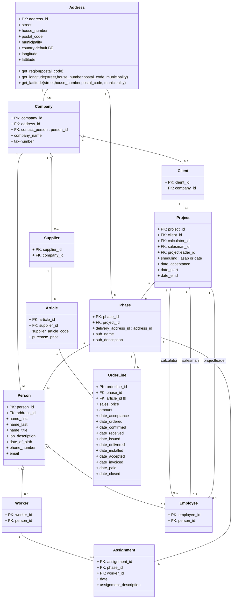
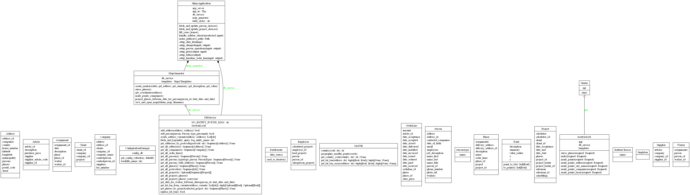

# Projectsamenvatting

Dit project maakt gebruik van een eenvoudige maar doeltreffende architectuur, gebaseerd op drie kerncomponenten:

## GUI
- **Shiny**: Lichtgewicht en modern Python-framework voor het bouwen van web-, desktop- en mobiele apps.
- **Folium**: Gebruikt voor interactieve geografische visualisaties (kaarten) op basis van Leaflet.js.
- Samen zorgen ze voor een intuïtieve, responsieve en visueel aantrekkelijke gebruikersinterface.

## Datalaag
- **SQLAlchemy**: Object-Relational Mapper (ORM) voor efficiënte en veilige interactie met de databank.
- Zorgt voor abstractie van SQL en maakt het werken met datamodellen eenvoudig en krachtig.

## Database
- **PostgreSQL**: Krachtig en betrouwbaar relationeel databasesysteem.
- Ideaal voor complexe datamodellen en schaalbare toepassingen.
- (Optioneel: uitbreidbaar met PostGIS voor georuimtelijke gegevens.)

---

# Technisch Overzicht

## Componentenoverzicht

| Component       | Technologie | Functie                                     |
|----------------|-------------|---------------------------------------------|
| GUI            | SHINY       | Gebruikersinterface                         |
| Kaartvisualisatie | Folium      | Interactieve kaarten (Leaflet.js)          |
| ORM / Datalaag | SQLAlchemy  | Abstractie van SQL, communicatie met DB     |
| Database       | PostgreSQL  | Opslag van gegevens, relationele structuur  |

## Dataflow

Gebruiker
   ↓
SHINY (GUI)
   ├──→ Folium (voor kaartvisualisatie)
   ↓
SQLAlchemy (ORM)
   ↓
PostgreSQL (Database)

## To start shiny
uvicorn src.gui.app:app --port 8081

# DRAFT

nog over te zetten in andere class
		
		+ get_sub_assignments() : list
		+ get_status(get_sub_assignments())
		+ get_status_date(get_sub_assignments())
		+ get_status(get_sub_assignments())
		+ get_status_date(get_sub_assignments())
		+ get_date_ordered(get_sub_assignments())
		+ get_date_received(get_sub_assignments())
		+ get_date_issued(get_sub_assignments())
		+ get_date_deliverd(get_sub_assignments())
		+ get_date_installed(get_sub_assignments())
		+ get_date_invoiced(get_sub_assignments())

		+ get_assignment_lines() : list
		+ get_status(get_assignment_lines())
		+ get_status_date(get_assignment_lines())
		+ get_date_ordered(get_assignment_lines())
		+ get_date_received(get_assignment_lines())
		+ get_date_issued(get_assignment_lines())
		+ get_date_delivered(get_assignment_lines())
		+ get_date_installed(get_assignment_lines())
		+ get_date_invoiced(get_assignment_lines())

		+ get_day_assignments(date)

		+ get_status_by_date()
		+ get_status_date()

	
		+ rejected_projects()
		+ get_open_projects()
		+ get_closed_projects()

		+ get_open_supplies()
		+ get_closed_supplies()

