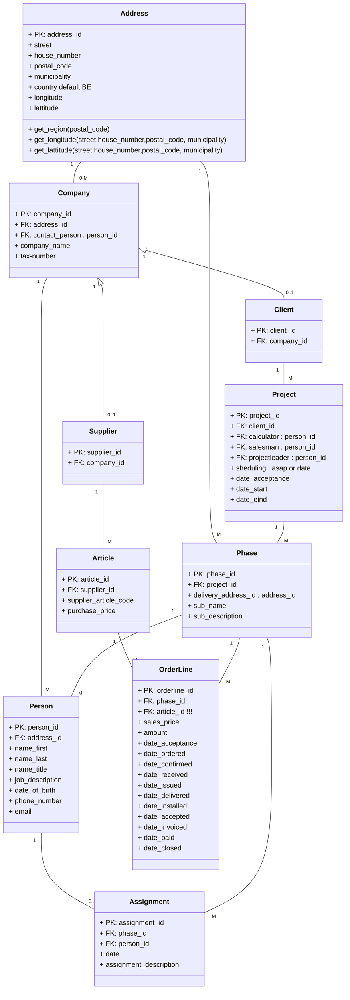

```mermaid

classDiagram

	class Address {
		+ PK: address_id
		+ street
		+ house_number
		+ postal_code
		+ municipality
		+ country default BE
		+ longitude
		+ lattitude
		+ get_region(postal_code)
		+ get_longitude(street,house_number,postal_code, municipality)
		+ get_lattitude(street,house_number,postal_code, municipality)
		}
		Address "1"--"M" Phase
		Address "1"--"0-M" Company


	class Person {
		+ PK: person_id
		+ FK: address_id
		+ name_first
		+ name_last
		+ name_title
		+ job_description
		+ date_of_birth
		+ phone_number
		+ email
		}
		Person "1"--"0..M" Assignment


	class Company {
		+ PK: company_id
		+ FK: address_id
		+ FK: contact_person : person_id
		+ company_name
		+ tax-number
		}
		Company "1"<|--"0..1" Client
		Company "1"<|--"0..1" Supplier 
		Company "1"--"M" Person


	class Client {
		+ PK: client_id
		+ FK: company_id

		}
		Client "1"--"M" Project

	class Supplier {
		+ PK: supplier_id
		+ FK: company_id

		}
		Supplier "1"--"M" Article

	class Article {
		+ PK: article_id
		+ FK: supplier_id
		+ supplier_article_code
		+ purchase_price
		}
		Article "1"--"M" OrderLine

	class Project {
		+ PK: project_id
		+ FK: client_id
		+ FK: calculator : person_id
		+ FK: salesman : person_id
		+ FK: projectleader : person_id
		+ sheduling : asap or date
		+ date_acceptance
		+ date_start
		+ date_eind
		}
		Project "1"--"M" Phase
		Phase "1"--"M" Person


	class Phase {
		+ PK: phase_id
		+ FK: project_id
		+ delivery_address_id : address_id
		+ sub_name
		+ sub_description		
		}
		Phase "1"--"M" OrderLine
		Phase "1"--"M" Assignment

	

	class OrderLine {
		+ PK: orderline_id
		+ FK: phase_id
    	+ FK: article_id   !!!      
    	+ sales_price
     	+ amount
    	+ date_acceptance 
		+ date_ordered      
		+ date_confirmed
		+ date_received     
		+ date_issued       
		+ date_delivered     
		+ date_installed    
		+ date_accepted       
		+ date_invoiced     
		+ date_paid         
		+ date_closed
		}


	class Assignment {
		+ PK: assignment_id
		+ FK: phase_id
		+ FK: person_id
		+ date
		+ assignment_description
		}

```
