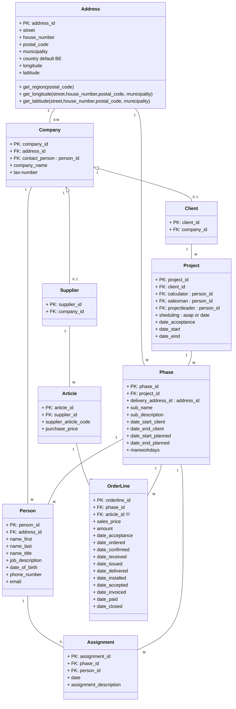

# DRAFT

nog over te zetten in andere class
		
		+ get_sub_assignments() : list
		+ get_status(get_sub_assignments())
		+ get_status_date(get_sub_assignments())
		+ get_status(get_sub_assignments())
		+ get_status_date(get_sub_assignments())
		+ get_date_ordered(get_sub_assignments())
		+ get_date_received(get_sub_assignments())
		+ get_date_issued(get_sub_assignments())
		+ get_date_deliverd(get_sub_assignments())
		+ get_date_installed(get_sub_assignments())
		+ get_date_invoiced(get_sub_assignments())

		+ get_assignment_lines() : list
		+ get_status(get_assignment_lines())
		+ get_status_date(get_assignment_lines())
		+ get_date_ordered(get_assignment_lines())
		+ get_date_received(get_assignment_lines())
		+ get_date_issued(get_assignment_lines())
		+ get_date_delivered(get_assignment_lines())
		+ get_date_installed(get_assignment_lines())
		+ get_date_invoiced(get_assignment_lines())

		+ get_day_assignments(date)

		+ get_status_by_date()
		+ get_status_date()

	
		+ rejected_projects()
		+ get_open_projects()
		+ get_closed_projects()

		+ get_open_supplies()
		+ get_closed_supplies()

	

	

