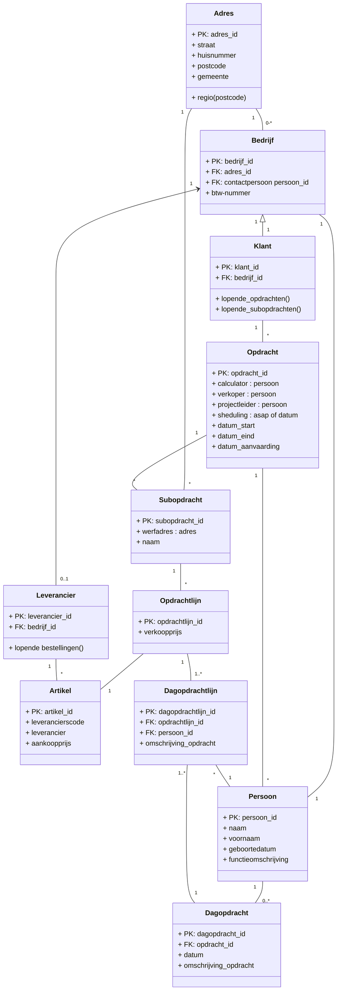

```mermaid
classDiagram


	class Bedrijf {
		+ PK: bedrijf_id
		+ FK: adres_id
		+ FK: contactpersoon persoon_id
		+ btw-nummer
		}
		Bedrijf "1"<|--"1" Klant
		Bedrijf "1"<--"0..1" Leverancier 
		Bedrijf "1"--"1" Persoon


	class Klant {
		+ PK: klant_id
		+ FK: bedrijf_id
		+ lopende_opdrachten()
		+ lopende_subopdrachten()
		}
		Klant "1"--"*" Opdracht


	class Adres {
		+ PK: adres_id
		+ straat
		+ huisnummer
		+ postcode
		+ gemeente
		+ regio(postcode)
		}
		Adres "1"--"*" Subopdracht
		Adres "1"--"0-*" Bedrijf

	
	class Opdracht {
		+ PK: opdracht_id
		+ calculator : persoon
		+ verkoper : persoon
		+ projectleider : persoon
		+ sheduling : asap of datum
		+ datum_start
		+ datum_eind
		+ datum_aanvaarding
		}
		Opdracht "1"--"*" Subopdracht
		Opdracht "1"--"*" Persoon


	class Subopdracht {
		+ PK: subopdracht_id
		+ werfadres : adres
		+ naam
		}
		Subopdracht "1"--"*" Opdrachtlijn


	class Opdrachtlijn {
		+ PK: opdrachtlijn_id
		+ verkoopprijs
		}
		Opdrachtlijn "*"--"1" Artikel
		Opdrachtlijn "1"--"1..*" Dagopdrachtlijn


	class Artikel {
		+ PK: artikel_id
		+ leverancierscode
		+ leverancier
		+ aankoopprijs
		}


	class Persoon {
		+ PK: persoon_id
		+ naam
		+ voornaam
		+ geboortedatum
		+ functieomschrijving
		}
		Persoon "1"--"0..*" Dagopdracht


	class Dagopdracht {
		+ PK: dagopdracht_id
		+ FK: opdracht_id
		+ datum
		+ omschrijving_opdracht
		}
		Dagopdrachtlijn "*"--"1" Persoon
		Dagopdracht "1"--"1..*" Dagopdrachtlijn
	

	class Leverancier {
		+ PK: leverancier_id
		+ FK: bedrijf_id
		+ lopende bestellingen()
		}
		Leverancier "1"--"*" Artikel


	class Dagopdrachtlijn {
		+ PK: dagopdrachtlijn_id
		+ FK: opdrachtlijn_id
		+ FK: persoon_id
		+ omschrijving_opdracht
	}


	

```

