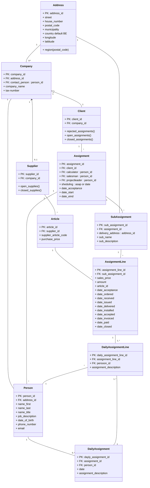

---
install this extension in vs-code to view the mermaid-diagram, or open it in obsidian

---

 
 
 

```mermaid
classDiagram


	class Address {
		+ PK: address_id
		+ street
		+ house_number
		+ postal_code
		+ municipality
		+ country default BE
		+ region(postal_code)
		+ longitude
		+ lattitude
		}
		Address "1"--"*" SubAssignment
		Address "1"--"0-*" Company


	class Person {
		+ PK: person_id
		+ FK: address_id
		+ name_first
		+ name_last
		+ name_title
		+ job_description
		+ date_of_birth
		+ phone_number
		+ email
		}
		Person "1"--"0..*" DailyAssignment


	class Company {
		+ PK: company_id
		+ FK: address_id
		+ FK: contact_person : person_id
		+ company_name
		+ tax-number
		}
		Company "1"<|--"1" Client
		Company "1"<--"0..1" Supplier 
		Company "1"--"*" Person


	class Client {
		+ PK: client_id
		+ FK: company_id
		+ rejected_assignments()
		+ open_assignments()
		+ closed_assignments()
		}
		Client "1"--"*" Assignment

	class Supplier {
		+ PK: supplier_id
		+ FK: company_id
		+ open_supplies()
		+ closed_supplies()
		}
		Supplier "1"--"*" Article

	class Article {
		+ PK: article_id
		+ FK: supplier_id
		+ supplier_article_code
		+ purchase_price
		}
		Article "1"--"*" AssignmentLine

	class Assignment {
		+ PK: assignment_id
		+ FK: client_id
		+ FK: calculator : person_id
		+ FK: salesman : person_id
		+ FK: projectleader : person_id
		+ sheduling : asap or date
		+ date_acceptance
		+ date_start
		+ date_eind
		}
		Assignment "1"--"*" SubAssignment
		Assignment "1"--"*" Person


	class SubAssignment {
		+ PK: sub_assignment_id
		+ FK: assignment_id
		+ delivery_address : address_id
		+ sub_name
		+ sub_description
		}
		SubAssignment "1"--"*" AssignmentLine


	class AssignmentLine {
		+ PK: assignment_line_id
		+ FK: sub_assignment_id
    	+ sales_price
     	+ amount
    	+ article_id         
    	+ date_acceptance 
		+ date_ordered      
		+ date_received     
		+ date_issued       
		+ date_delivered     
		+ date_installed    
		+ date_accepted       
		+ date_invoiced     
		+ date_paid         
		+ date_closed
		}
		AssignmentLine "1"--"1..*" DailyAssignmentLine


	class DailyAssignment {
		+ PK: dayly_assignment_id
		+ FK: assignment_id
		+ FK: person_id
		+ date
		+ assignment_description
		}
		DailyAssignmentLine "*"--"1" Person
		DailyAssignment "1"--"1..*" DailyAssignmentLine


	class DailyAssignmentLine {
		+ PK: daily_assignment_line_id
		+ FK: assignment_line_id
		+ FK: persoon_id
		+ assignment_description
	}


		


	


	


	

```

