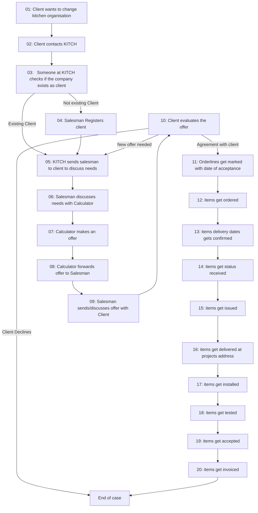

This chart is ment to clarify the flow a a product from a clients question to invoicing the product.

```mermaid


graph TD

	01[01: Client wants to change kitchen organisation]
	01 --> 02


	02[02: Client contacts KITCH]
	02 --> 03


	03[03: 	Someone at KITCH checks if the company exists as client]
	03 -->|Not existing Client	| 04
	03 -->|Existing Client		| 05


	04[04: Salesman Registers client]
	04 --> 05


	05[05: KITCH sends salesman to client to discuss needs]
	05 --> 06


	06[06: Salesman discusses needs with Calculator]
	06 --> 07


	07[07: Calculator makes an offer]
	07 --> 08


	08[08: Calculator forwards offer to Salesman]
	08 --> 09


	09[09: Salesman sends/discusses offer with Client]
	09 --> 10


	10[10: Client evaluates the offer]
	10 -->|Agreement with client	| 11
	10 -->|New offer needed			| 05
	10 -->|Client Declines			| 99


	11[11: Orderlines get marked with date of acceptance]
	11 --> 12


	12[12: items get ordered]
	12 --> 13


	13[13: items delivery dates gets confirmed]
	13 --> 14


	14[14: items get status received]
	14 --> 15


	15[15: items get issued]
	15 --> 16


	16[16: items get delivered at projects address]
	16 --> 17


	17[17: items get installed]
	17 --> 18


	18[18: items get tested]
	18 --> 19


	19[19: items get accepted]
	19 --> 20


	20[20: items get invoiced]
	20 --> 99


	99[End of case]

```

	

	

